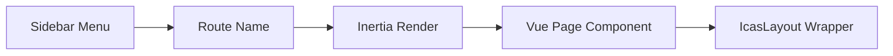

# ICAS Frontend Architecture & Design Guide

## Overview

ICAS frontend is built with **Vue 3 (Composition API)**, **Inertia.js**, **Tailwind CSS**, and **PrimeVue** components, following a modular, component-based architecture optimized for maintainability and scalability.

---

## Technology Stack

- **Framework:** Vue 3 with Composition API (`<script setup>`)
- **Build Tool:** Vite 7.x with Hot Module Replacement (HMR)
- **Styling:** Tailwind CSS 3.x + PrimeVue 4.5.1 design tokens
- **Icons:** PrimeIcons 7.0.0
- **State Management:** Pinia (when needed)
- **Server Integration:** Inertia.js 1.0 (SSR-ready)
- **Auth:** Laravel Jetstream + Fortify with session-based authentication

---

## Project Structure

```
application/resources/js/
├── Components/
│   └── Layout/
│       ├── Sidebar.vue          # Collapsible sidebar navigation
│       └── TopBar.vue            # Top navigation bar
├── Layouts/
│   ├── AppLayout.vue             # Jetstream default layout
│   └── IcasLayout.vue            # ICAS main layout (Sidebar + TopBar)
├── Pages/
│   ├── Dashboard/
│   │   └── Index.vue
│   ├── Map/
│   │   └── Index.vue
│   ├── Alerts/
│   │   ├── Active.vue
│   │   ├── History.vue
│   │   └── Config.vue
│   ├── Sensors/
│   │   ├── Status.vue
│   │   └── Manage.vue
│   ├── Cameras/
│   │   ├── Live.vue
│   │   └── Recordings.vue
│   ├── Access/
│   │   └── Index.vue
│   ├── Reports/
│   │   ├── Daily.vue
│   │   ├── Monthly.vue
│   │   └── Custom.vue
│   ├── Users/
│   │   └── Index.vue
│   ├── Devices/
│   │   └── Index.vue
│   ├── Logs/
│   │   └── Index.vue
│   └── Settings/
│       ├── General.vue
│       ├── Security.vue
│       └── Notifications.vue
└── app.js                        # Main entry point
```

---

## Layout System

### IcasLayout.vue

Main application layout providing consistent UI across all ICAS pages.

**Features:**
- Collapsible sidebar (narrow/expanded states)
- Top navigation bar with site selector
- User menu with profile/logout
- Responsive mobile support

**Usage:**
```vue
<script setup>
import IcasLayout from '@/Layouts/IcasLayout.vue';
</script>

<template>
  <IcasLayout title="Page Title">
    <!-- Page content here -->
  </IcasLayout>
</template>
```

**Props:**
- `title` (String): Page title for `<Head>` tag

---

## Component Reference

### Sidebar.vue

**Location:** `Components/Layout/Sidebar.vue`

**Features:**
- 11 menu items with icons (PrimeIcons)
- 5 items with expandable submenus
- Collapsible width: `w-20` (narrow) ↔ `w-72` (expanded)
- Submenu floating panels using `v-styleclass` directive
- User section slot at bottom

**Props:**
- `expanded` (Boolean): Sidebar expanded state
- `activeMenuItem` (String): Currently active menu item key

**Events:**
- `update:expanded`: Emitted when sidebar toggle is clicked
- `update:activeMenuItem`: Emitted when menu item is selected

**Menu Structure:**
```javascript
{
  key: 'dashboard',           // Unique identifier
  label: 'Dashboard',          // Display text
  icon: 'pi pi-home',          // PrimeIcon class
  route: 'dashboard',          // Laravel route name
  items: [...]                 // Optional submenu items
}
```

**Submenu Implementation:**
Uses PrimeVue's `v-styleclass` directive for smooth show/hide animations:
```vue
<a v-styleclass="{ 
  selector: '@next', 
  enterFromClass: 'hidden', 
  leaveToClass: 'hidden', 
  hideOnOutsideClick: true 
}">
```

**Styling Notes:**
- Submenu panels: `bg-white border border-surface-200 shadow-lg z-20`
- Desktop: `lg:absolute left-full top-0` (floats to the right)
- Mobile: `static` (displays inline)

---

### TopBar.vue

**Location:** `Components/Layout/TopBar.vue`

**Features:**
- Site selector dropdown (Monroe County Jail, City Center Facility, North Campus)
- Action icons: Queue, Help, Notifications (with badge)
- User profile menu with name and avatar
- Mobile menu toggle button
- Blue gradient background (`from-blue-600 to-blue-800`)

**State Management:**
- `selectedSite`: Current facility selection
- `userMenuRef`: Reference for PrimeVue Menu component
- `userMenuItems`: Profile and Logout options

**Responsive Behavior:**
- Mobile: Shows hamburger menu icon
- Desktop: Shows all action icons and user dropdown

---

## Routing Structure

All routes defined in `routes/web.php` with proper naming conventions:

```php
Route::middleware(['auth:sanctum', config('jetstream.auth_session'), 'verified'])
    ->group(function () {
        // Dashboard
        Route::get('/dashboard', ...)->name('dashboard');
        
        // Map
        Route::get('/map', ...)->name('map.index');
        
        // Alerts
        Route::prefix('alerts')->group(function () {
            Route::get('/active', ...)->name('alerts.active');
            Route::get('/history', ...)->name('alerts.history');
            Route::get('/config', ...)->name('alerts.config');
        });
        
        // ... and so on
    });
```

**Route Naming Convention:**
- Single pages: `{module}.index` (e.g., `map.index`)
- Nested pages: `{module}.{action}` (e.g., `alerts.active`)

---

## Design System

### Color Palette

Using PrimeVue design tokens with dark theme support:

- **Surface:** `surface-0`, `surface-50`, `surface-200`, `surface-400`, `surface-700`, `surface-800`, `surface-900`
- **Primary:** `primary`, `primary-contrast`
- **Status Colors:** `green-600` (online), `red-600` (alerts)

### Typography

- **Headings:** `text-3xl font-bold text-surface-900 dark:text-surface-0`
- **Body:** `text-base text-surface-600 dark:text-surface-300`
- **Labels:** `text-sm font-medium`

### Spacing

- **Container Padding:** `p-6`
- **Grid Gaps:** `gap-6`
- **Card Spacing:** `p-6` or `p-8`

### Components

- **Cards:** `bg-surface-50 dark:bg-surface-800 p-6 rounded-lg border border-surface-200 dark:border-surface-700`
- **Placeholders:** `border-2 border-dashed border-surface-200 dark:border-surface-700 rounded-2xl`

---

## Navigation Flow

### Menu Items → Routes → Pages



**Example:**
1. User clicks "Active Alerts" in sidebar
2. Sidebar emits route: `alerts.active`
3. Router navigates to `/alerts/active`
4. Laravel returns `Inertia::render('Alerts/Active')`
5. Vue renders `Pages/Alerts/Active.vue` wrapped in `IcasLayout`

---

## Responsive Design

### Breakpoints

- **Mobile:** `< 1024px` (lg breakpoint)
- **Desktop:** `≥ 1024px`

### Sidebar Behavior

- **Mobile:**
  - Hidden by default (`hidden lg:flex`)
  - Toggles via hamburger menu
  - Overlays content with `absolute` positioning
  
- **Desktop:**
  - Always visible (`lg:flex`)
  - Collapsible between narrow (`w-20`) and expanded (`w-72`)
  - Static positioning (`lg:static`)

### Submenu Behavior

- **Mobile:** Displays inline below parent item
- **Desktop:** Floats to the right as absolute-positioned panel

---

## State Management

### Sidebar State

Managed in `IcasLayout.vue`:
```javascript
const sidebarExpanded = ref(false);        // Sidebar width state
const activeMenuItem = ref('dashboard');   // Current page tracking
```

### Site Selection

Managed in `TopBar.vue`:
```javascript
const selectedSite = ref({ name: 'Monroe County Jail', code: 'MCJ' });
const sites = ref([
  { name: 'Monroe County Jail', code: 'MCJ' },
  { name: 'City Center Facility', code: 'CCF' },
  { name: 'North Campus', code: 'NC' },
]);
```

---

## Build & Development

### Development Commands

```bash
# Start dev server with HMR
npm run dev

# Build for production
npm run build

# Build and watch for changes
npm run watch
```

### Build Output

- **Location:** `public/build/`
- **Chunks:** Lazy-loaded per page (code splitting)
- **Assets:** CSS, JS, and source maps

**Typical Build Sizes:**
- `IcasLayout.js`: ~12.73 KB (gzipped: 4.21 KB)
- `Dashboard.js`: ~19.30 KB (gzipped: 5.77 KB)
- `app.js`: ~303 KB (gzipped: 105 KB)

---

## Best Practices

### Component Creation

1. Use `<script setup>` for Composition API
2. Import `IcasLayout` for all ICAS pages
3. Define props with `defineProps()` and events with `defineEmits()`
4. Use PrimeVue components when available

### Styling

1. Prefer Tailwind utility classes over custom CSS
2. Use PrimeVue design tokens (`surface-*`, `primary-*`)
3. Always provide dark mode variants (`dark:bg-surface-800`)
4. Use `!` modifier for important utilities (`text-lg!`)

### Navigation

1. Always use named routes: `router.visit(route('dashboard'))`
2. Never hardcode URLs
3. Update `routes/web.php` when adding new pages
4. Emit route navigation from components, don't navigate directly

### Performance

1. Lazy load page components (handled by Vite)
2. Use `v-if` for conditional heavy components
3. Avoid large computed properties
4. Use `shallowRef` for large reactive objects

---

## Common Patterns

### Creating a New Page

1. **Create Vue component:**
   ```vue
   <!-- Pages/NewModule/Index.vue -->
   <script setup>
   import IcasLayout from '@/Layouts/IcasLayout.vue';
   </script>

   <template>
     <IcasLayout title="New Module">
       <div class="space-y-6">
         <h1 class="text-3xl font-bold text-surface-900 dark:text-surface-0">New Module</h1>
         <!-- Content here -->
       </div>
     </IcasLayout>
   </template>
   ```

2. **Add route in `routes/web.php`:**
   ```php
   Route::get('/new-module', function () {
       return Inertia::render('NewModule/Index');
   })->name('newmodule.index');
   ```

3. **Add menu item in `Sidebar.vue`:**
   ```javascript
   {
     key: 'newmodule',
     label: 'New Module',
     icon: 'pi pi-star',
     route: 'newmodule.index'
   }
   ```

4. **Rebuild:** `npm run build`

---

## Troubleshooting

### Submenu Not Appearing

**Issue:** Submenu doesn't show when clicked

**Solutions:**
1. Check parent container has `lg:overflow-visible`
2. Verify `v-styleclass` directive is properly configured
3. Ensure submenu has `z-20` or higher z-index
4. Check background is opaque (`bg-white` not `bg-transparent`)

### Route Not Found

**Issue:** Navigation fails with 404

**Solutions:**
1. Verify route is defined in `routes/web.php`
2. Check route name matches exactly in Sidebar component
3. Clear route cache: `php artisan route:clear`
4. Rebuild frontend: `npm run build`

### Dark Mode Not Working

**Issue:** Dark theme styles not applying

**Solutions:**
1. Ensure both light and dark variants are defined: `bg-surface-50 dark:bg-surface-800`
2. Check PrimeVue theme configuration in `app.js`
3. Verify Tailwind dark mode is enabled in `tailwind.config.js`

---

## Future Enhancements

### Planned Features

- [ ] Real-time notifications via Laravel Echo + Reverb
- [ ] Advanced data tables with sorting/filtering
- [ ] Interactive map integration (Leaflet/Mapbox)
- [ ] Chart components for analytics (Chart.js/ApexCharts)
- [ ] Form validation with Vuelidate or VeeValidate
- [ ] File upload components with progress tracking
- [ ] Toast notifications for user feedback
- [ ] Breadcrumb navigation
- [ ] Search functionality across modules

### Architecture Improvements

- [ ] Global state management with Pinia
- [ ] Composables for shared logic (`useAuth`, `useNotifications`)
- [ ] Unit tests with Vitest
- [ ] E2E tests with Cypress/Playwright
- [ ] Component library documentation (Storybook)
- [ ] Accessibility (ARIA labels, keyboard navigation)

---

## Maintenance Notes

### Dependencies

Update regularly:
```bash
npm update
composer update
```

### Build Optimization

Monitor bundle sizes:
```bash
npm run build -- --mode=analyze
```

### Code Quality

Run linters:
```bash
npm run lint
npm run format
```

---

## Support & Resources

- **PrimeVue Docs:** https://primevue.org/
- **Tailwind CSS Docs:** https://tailwindcss.com/
- **Vue 3 Docs:** https://vuejs.org/
- **Inertia.js Docs:** https://inertiajs.com/
- **Laravel Docs:** https://laravel.com/docs

---

**Last Updated:** December 7, 2025  
**Version:** 1.0.0  
**Maintained By:** ICAS Development Team
